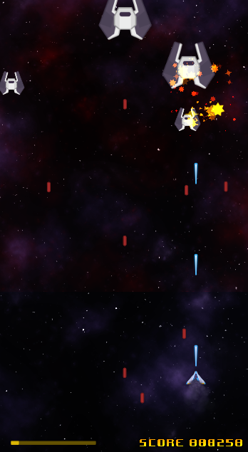

# Laser Defender 

Clone of [delivery driver](https://www.gamedev.tv/courses/1394720/lectures/33955613) game from [Gamedev.tv](https://www.gamedev.tv) done in cocos creator 3.6

Demo here: https://tabanella.me/cocos-creator-laser-defender/

List of subjects

 - Assets
 - Input system
 - Boundaries
 - Spawning enemies
 - Enemy Pathfinding
 - Instantiate Enemy (Prefab)
 - Taking damage
 - Shooting
 - Particle system
 - Screen Shake
 - Scrolling Background (Parallax)
 - Sound Effects (Audio Manager)
 - Music
 - Score (Singleton)
 - Scene Manager
 - Game UI